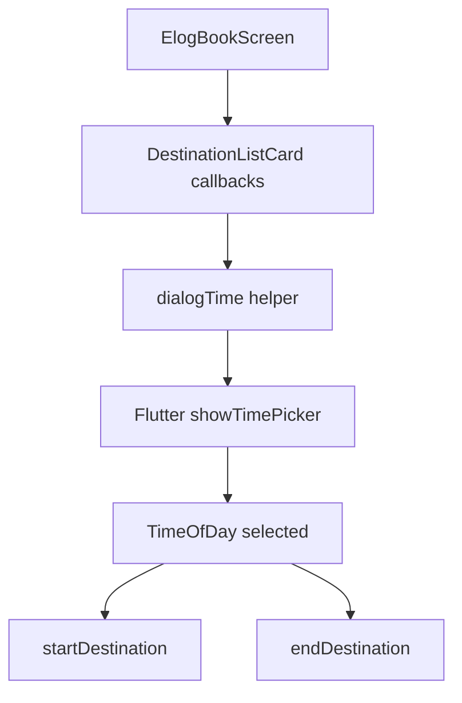

# Replace custom time picker in `elogBook.dart`

## Goal

Update the e-log book screen to use Flutter’s built-in time picker (`showTimePicker`) instead of the project-specific `custom_time_picker.dart`, and remove the custom picker file from the project.

## Current usage overview

Key places in [`lib/screens/Driver/elogBook.dart`](lib/screens/Driver/elogBook.dart):

- Import of the custom picker:
  - `import 'package:transport_flutter/components/Driver/custom_time_picker.dart';` (around lines 9–13)
- The helper that opens the custom time picker:
  - `dialogTime(Function(TimeOfDay) callBack)` (around lines 889–916)
  - Uses `showTimePickerCustom` from `custom_time_picker.dart` with a `builder` that wraps the picker in a custom `Scaffold` and `AppBar`.
- Call sites that depend on `dialogTime` to obtain a `TimeOfDay`:
  - In `_buildChildren` → `DestinationListCard` callbacks:
    - `startDestination: () { dialogTime((val) { ... startDestination(..., val); }); }`
    - `endDestination: (int desId, bool adHoc) { dialogTime((val) { endDestination(..., val); }); }`

There are no other references to `custom_time_picker.dart` in this file.

## High-level changes

1. **Switch to built-in `showTimePicker` API**
   - Replace `showTimePickerCustom` usage inside `dialogTime` with a call to Flutter’s `showTimePicker`.
   - Preserve the return type (`TimeOfDay?`) and callback pattern (`Function(TimeOfDay) callBack`) so that callers (`startDestination` and `endDestination`) do not need to change.

2. **Remove import of `custom_time_picker.dart` from `elogBook.dart`**
   - Delete the line importing the custom picker, since we will no longer reference anything from that file.

3. **Delete `custom_time_picker.dart` file from the project**
   - Remove [`lib/components/Driver/custom_time_picker.dart`](lib/components/Driver/custom_time_picker.dart), as requested.
   - Ensure there are no other imports/usages in the codebase; if there are, either:
     - Update them to use `showTimePicker`, or
     - If they are dead code, remove those usages/imports as well.

4. **Keep or simplify the custom dialog wrapper (optional small refactor)**
   - Option A (minimal change): keep `dialogTime` wrapping `showTimePicker` inside a custom `Scaffold` with the `SELECT TIME` app bar, by passing a `builder` to `showTimePicker` that returns the same layout.
   - Option B (simpler UI): drop the custom `Scaffold` and just call `showTimePicker` without a builder, using the default Material time picker dialog.
   - Default plan: **use Option A** first to preserve the current UX, only adjusting internals to rely on `showTimePicker` instead of the custom implementation.

5. **Verify behavior and type compatibility**
   - Confirm that `dialogTime` still:
     - Shows a time picker when called from the `DestinationListCard` callbacks.
     - Returns a non-null `TimeOfDay` to the callback when the user selects a time and confirms.
     - Does nothing (does not call the callback) when the user cancels the picker.
   - Ensure `startDestination` and `endDestination` continue to receive the selected time and convert it as before (no change needed in their signatures or logic).

6. **Compile and run analysis/lints (when you apply the plan)**
   - Run `flutter analyze` (or your existing analyzer/CI) after the edits.
   - Fix any new errors or warnings related to the removal of `custom_time_picker.dart` (e.g., unused imports, missing references elsewhere).

## Step-by-step implementation plan

1. **Remove the custom picker import from `elogBook.dart`**
   - Edit [`lib/screens/Driver/elogBook.dart`](lib/screens/Driver/elogBook.dart):
     - Delete the line:
       - `import 'package:transport_flutter/components/Driver/custom_time_picker.dart';`

2. **Update `dialogTime` to use `showTimePicker`**
   - In `dialogTime(Function(TimeOfDay) callBack)` (around lines 889–916 in `elogBook.dart`):
     - Replace `showTimePickerCustom` with Flutter’s `showTimePicker`:
       - Keep the same `context` and `initialTime: TimeOfDay.now()`.
       - Pass the existing `builder` callback if you want to preserve the custom `Scaffold` UI.
     - Confirm the method still awaits a `TimeOfDay?` and calls `callBack` only when non-null.

3. **Double-check all usages of `dialogTime`**
   - Still in `elogBook.dart`, in `_buildChildren`:
     - Verify that:
       - `startDestination: () { dialogTime((val) async { ... startDestination(..., val); }); }` still compiles.
       - `endDestination: (int desId, bool adHoc) { dialogTime((val) { endDestination(..., val); }); }` still compiles.
     - No code changes should be needed here; this is just a compatibility check.

4. **Search for other usages of `custom_time_picker.dart`**
   - Grep the project for `custom_time_picker.dart` and `showTimePickerCustom`.
   - For each occurrence:
     - If it’s still needed, replace it with a `showTimePicker`-based helper similar to `dialogTime`, local to that screen/component.
     - If it’s dead code, remove the import and related helper functions.

5. **Delete `custom_time_picker.dart` file**
   - Once all references are removed/updated:
     - Delete [`lib/components/Driver/custom_time_picker.dart`](lib/components/Driver/custom_time_picker.dart) from the project.

6. **Run analyzer/tests and adjust**
   - Run `flutter analyze` to ensure no missing imports or type errors remain.
   - If any analyzer errors point to the removed file or its symbols:
     - Update the affected files to use `showTimePicker` or remove the dead code.

## Mermaid overview (time-picking flow)

